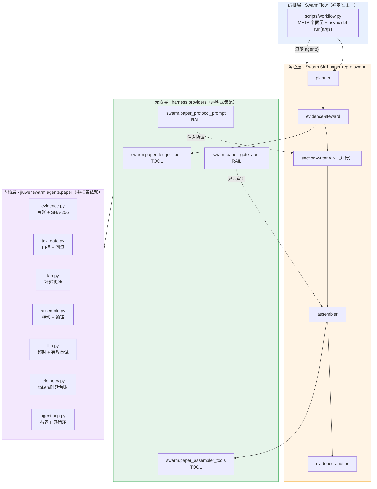
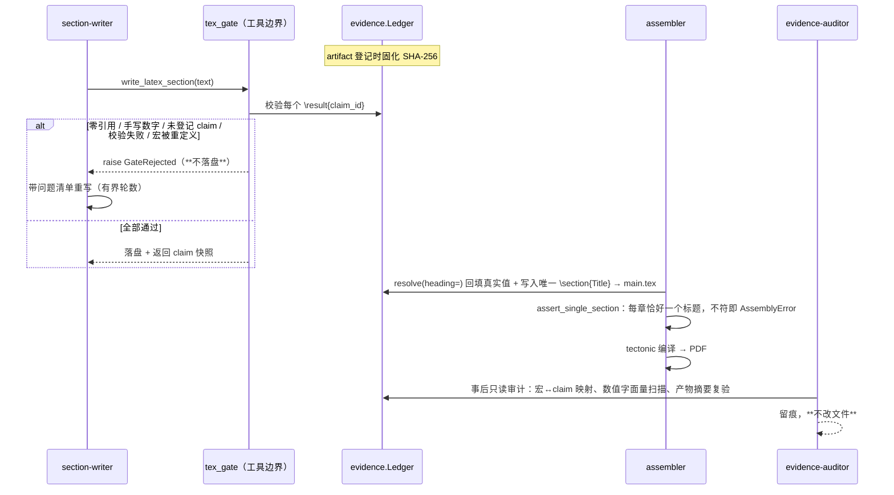

# 技术文档：架构设计 / 模块调用 / 创新点

> 面向两类读者：想复用这套工程的人（看架构与模块契约），和想评估这套方案的评审（看创新点与设计取舍）。
> 文中每个"实测"都指向仓内可复读的证据文件，不写"应该没问题"。

---

## 1. 结论

PaperSwarm 是**一个证据门控的多智能体论文生成系统**，核心命题只有一句：

> **论文里的每个数字都必须能追溯到一份内容未被篡改的实验产物。**

实现方式不是"在 prompt 里劝模型不要编造"（那是**不可验证**的约束），而是让数字**根本没有手写入口**：
正文只能写 `\result{claim_id}`，编译前由证据台账回填真实值；产物被事后改写，SHA-256 校验会拦下。

**当前完成度**：端到端链路已跑通并产出真实 PDF（4 页，ICLR 2026 模板，tectonic 编译），
论文中 6 处结论数值全部由台账回填；框架侧已接入 JiuwenSwarm 的 4 个 harness 元素 +
1 个 5 角色 Swarm Skill + 1 个 Swarmflow 流程。**未完成**部分明确列在 §8。

---

## 2. C3 前置判断：这个需求真的需要 Agent 吗？

**结论：只有约 30% 真的需要，70% 是确定性工作流。** 这个判断决定了整个架构形态。

| 子任务 | 需要 Agent？ | 理由 |
|---|---|---|
| LaTeX 撰写、编译、页数/体积核查 | ❌ | 固定流程 + 门控即可；上 Agent 只引入不确定性 |
| 「起草 → 登记证据 → 撰写 → 组装 → 审计」的**阶段骨架** | ❌ | 阶段固定、顺序固定、有质量门 → 正是 SwarmFlow 的适用面 |
| 章节写作 | ✅（弱） | 需要语言生成，但**约束由门控给，不靠模型自觉** |
| 文献检索与候选筛选 | ✅ | 检索路径开放、结果非确定性 |
| 复现实验调试 | ✅ | 依赖冲突/报错/超参漂移是开放问题，需要「跑-看-修」 |
| 对抗审稿 → 修订 | ✅ | Evaluator-Optimizer，停止条件必须显式定义 |

**落地形态**：**SwarmFlow 确定性主干 + 主干节点上的自主 worker**。
**不采用**「一个 Agent 自由发挥到底」——那种写法在论文生产场景里收益极低、失控成本极高。

---

## 3. 架构

### 3.1 分层



**分层的意义**：L0 内核**不 import 任何 Agent 框架**。所以它能脱离 JiuwenSwarm 单独测试、
单独复现——这既是工程收益（证据层的正确性不依赖框架版本），也是本次能在本机把链路跑通的直接原因。

### 3.2 组件表（Swarmflow 四段 phase）

| phase | agent（label） | 职责 | 输入 | 输出 | 失败处理 |
|---|---|---|---|---|---|
| `Plan` | `plan` | 定章节清单与 must-cite 标记 | topic + 证据 schema | `PLAN` JSON（`sections` 列表） | `extract_json` fallback → 用 `DEFAULT_SECTIONS` |
| `Register evidence` | `evidence-steward` | 跑实验、登记 artifact、铸造 claim | 实验产物路径 | `EVIDENCE` JSON（`claims` + `claim_table`） | claim 值为空 → 下游拒写；`VERIFIED` 门未过则整个 run 记 degraded |
| `Draft sections` | `section-writer` × N（**并行**） | 每章独立写作，只能引 claim 宏 | claim 表 + 章节标题 + must-cite 标记 | `SECTION` JSON（`text`） | 缺 must-cite 章节 → 进 `missing_sections`，不静默补 |
| `Assemble and verify` | `assembler` → `evidence-auditor` | 回填 + 编译 PDF → 只读审计 | 章节文本 + 模板 | `BUILD`（`status=PDF-READY`）+ `AUDIT`（`verdict`） | 非 `PDF-READY` → **跳过审计**，`status=degraded`，`must_fix` 列出未解决项 |

**并行度**：`section-writer` 的扇出数 = planner 计划的章节数（dry-run 实测 5）。
每个写手只负责自己那一 slice——**不共享可变状态**，所以并行安全。

### 3.3 门控闭环（本系统的核心机制）



**关键设计**：强制点在 `write_latex_section` 这个**工具**里，不在 prompt、不在 hook。
理由是**契约可核实性**——工具是我们自己的 Python 函数，行为 100% 可控；
而 hook 的"如何表达拒绝"契约未核实（见 `upstream-contribution.md` P4），
所以 rail 只做**提示注入 + 事后只读审计**，`evidence-auditor` 发现越权写入时**留痕不改文件**。

### 3.4 五重上界（任何自主循环都必须有界）

`src/paperswarm/agentloop.py` 对工具调用循环设了 5 条独立上界。任一触发即停：

| 上界 | 触发后 | 实测覆盖 |
|---|---|---|
| `max_steps` | 步数用尽即停（硬上限 64，构造时**拒绝**更大值） | `loop_max_steps_bound` / `loop_rejects_unbounded_max_steps` |
| `token_budget` | 累计 token 超预算即停 | `loop_token_budget_bound` |
| `wall_clock_seconds` | 超墙钟即停 | `loop_wall_clock_bound` |
| `repeat_limit` | 连续 N 次**完全相同**的工具调用判定死循环 | `loop_detected_at_third_repeat` |
| `required_tools` | 必需工具未成功执行过 → **不许收尾**；提醒次数同样有上限 | `loop_bad_args_no_duplicate_execute` |

危险工具（`dangerous=True`）必须有 `confirm` 回调，**缺回调即拒绝执行**（fail-closed）。

**上界之间不互相掩盖失败原因**：如果模型被 `max_steps` 先截断，就以 `max_steps` 结束，
不会因为"required_tools 也满足了"而报成功。这是刻意的。

### 3.5 结构门控：章节标题与写手越界

证据门控保证"数字可信"，但它对"文档长什么样"完全无感。一次真实事故证明了这不够：
所有证据断言全绿、tectonic 退出码 0、页数体积合规，而**六个章节里只有两个有标题**。
根因是一条只写在 docstring 里、**没有任何代码实现**的分工——写手被告知"标题由组装器
统一加"，而组装器 `resolve_sections` 拿到 `(stem, title)` 后把 `title` 丢掉了
（`for stem, _title in sections:`，下划线前缀的未使用变量正是这种"约定无人实现"的信号）。

补救方式与证据门控同构 —— **把完成条件写进代码**：

| 检查 | 位置 | 失败行为 |
|---|---|---|
| 每章恰好一个顶层 `\section{Title}`，文本相符 | `assemble.assert_single_section()` | 抛 `AssemblyError`，不产出 PDF |
| 正文自带 `\section` → 剥离并**记入 warnings** | `tex_gate.resolve(heading=...)` | 剥离（静默丢弃正是事故成因，故必须留痕） |
| 子标题撞上正式章节名 / 正文自带标题 / 正文为空 | `assemble.check_section_prose()` | 与证据问题**合并进同一重写循环** |

**为什么标题必须由组装器独占**：若交给写手，标题的规范性就依赖于模型是否听话——
本机 7B 模型实测会把别章内容（`Experimental Setup`、`Conclusion`）当作子标题塞进引言。
由组装器写入则结构**与模型行为无关**，且可被断言。

**这条经验的一般形式**：门控查什么，就只保证什么。每类产物属性（数字、结构、引用、
页数）都需要各自的断言，不能指望一类断言覆盖另一类。详见 `bugfix-section-headings.md`。

---

## 4. 模块调用链（L0 内核逐个说明）

| 模块 | 职责 | 关键接口 | 失败处理 |
|---|---|---|---|
| `evidence.py` | 台账：artifact SHA-256 登记、claim 登记、`verify()` **四重校验** | `Ledger(dir)` / `register_artifact` / `add_claim` / `verify(check_artifacts=)` | 摘要不符 → 明确报"疑似篡改实验结果" |
| `tex_gate.py` | `\result{}` 扫描、门控、数值回填、章节标题注入 | `gate_text(strict_literals=)` / `gate_strict` / `resolve(src,dst,ledger,heading=)` | 任一门不过 → `GateRejected`，**不写文件** |
| `lab.py` | 真实对照实验（numpy），产出 `metrics.json` | `run_experiment()` / `write_json()` | — |
| `assemble.py` | 套 ICLR 2026 模板 + 回填 + 标题写入 + 结构断言 + 编译 + 页数/体积校验 | `assemble_paper(...)` / `assert_single_section()` / `check_section_prose()` | 编译失败或结构断言不过 → `AssemblyError`，**不做"先生成一个再说"的降级** |
| `llm.py` | OpenAI 兼容客户端 | `LLMConfig.from_yaml(profile=)` / `ChatClient.chat()` | 显式 connect/read 超时；指数退避 + 全抖动，有界重试；区分可重试/永久失败 |
| `telemetry.py` | 逐次调用 JSONL + 汇总 | `record_call` / `record_event` / `write_summary` | **不内置价格表**；无显式单价即记 `unpriced` |
| `agentloop.py` | 有界工具调用循环（五重上界） | `run(goal, ...)` | 工具异常回灌给模型而非崩栈；未知工具列出可用清单 |
| `tools.py` | 把台账包成模型可调工具 | `build_ledger_tools(compact=)` | 参数校验 + 路径越权拦截 |

**`verify()` 的四重校验**（这是防伪造的实质）：
① claim 绑定的 artifact 已登记 → ② 产物文件仍存在 → ③ **产物 SHA-256 与登记时一致** →
④ 按 JSON Pointer 从产物读出的实际值 == claim 声明值。

### 4.1 一次真实运行的完整调用链（可逐条回溯）

`runs/paper-20260929-161913/`：

```
[1/5] run_experiment()          numpy 对照实验（120 特征 / 90 训练 / 200 测试 / 8 种子）
       └─> exp/metrics.json      OLS=0.6198  Ridge=0.3041  improve=50.94%   (0.498s)
[2/5] register_artifact         固化 SHA-256 = ec42099aa169…
      add_claim × 11            每条 claim 的声明值必须与产物实际值一致，否则登记失败
      verify()                  passed=11 failed=0 ok=True
[3/5] ChatClient.chat × 8       逐章写作，每章过 gate_text(strict_literals=True)
       └─> writer.conclusion    第 1 次被拒（模型编造了不存在的 claim id `cl-std`）→ 第 2 次通过
[4/5] assemble_paper()          套模板 + resolve() 回填 6 处宏 + tectonic 编译
[5/5] main.pdf                  4 页 / 34,498 字节 / 页限 9 → ok
```

**"模型编造 claim id 被拦下"这条不是构造的测试用例，是本次真实运行里发生的事**
（`runs/paper-20260929-161913/events.jsonl` 第 7 行 `kind=gate_reject`）。
这是门控在端到端环境里生效的**直接证据**。

---

## 5. 创新点（4 条，按可辩护性排序）

### 创新点 1：Claim–Evidence Ledger —— 把诚信机制从"事后人审"改成"事前结构性拦截"

FARS 的诚信机制是**提交前 3 位资深研究者内审**（概率性、依赖人的注意力）。
本系统的机制是**产物层校验**：论文中每个数值型 claim 必须绑定 artifact 的 SHA-256，
未登记的数字在编译门控处**直接拦死**。

**为什么这是实质差异而不是措辞差异**：
- 人工内审的失效模式是"看漏了"，概率不可控且事后才发现；
- 产物校验的失效模式只有"伪造者同时改产物与台账"——而改产物必然破坏 SHA-256。
- **可验证性差异**：人审结论是主观的；"这个数字来自哪个文件、哪一行、当时摘要是什么"是客观可查的。

实测证据：篡改产物后 11 条 claim **全部**被拦截、退出码 1、门控拒绝产出文件
（`tests/test_evidence.py::test_tampered_artifact_blocks_gate` +
`reports/vendor_verify.json::ledger_detects_tampered_artifact`）。

### 创新点 2：约束放进代码，不放进 prompt

迭代中发现并修掉的 3 个**设计层面**缺陷，全部指向同一条工程结论：

| 缺陷 | 原设计（prompt 思路） | 修正后（代码思路） | 层级 |
|---|---|---|---|
| 安全漏洞：模型一个 `\result{}` 都不写，数字全手打，门控无从校验 | `gate_text` 只在**已有引用时**才校验 | 新增 `gate_strict`：要求 ≥1 个引用 + 手写数字拦截；写入路径强制启用 | **安全漏洞** |
| 小模型把步数全耗在逐条登记 claim，走不到写正文 | prompt 写"请批量登记" | 加批量 `add_claims` + 幂等复用；工具集 7 → 4 | **架构** |
| 模型"少做一步就宣布做完" | prompt 写"你必须调用 X" | 加第 5 条上界 `required_tools`：未成功执行过就不许收尾 | **架构** |

第一条尤其值得说：原设计认为"强制写宏"就够了，**漏掉了"一个宏都不写"这条绕过通道**——
只要不引用，门控就无从校验。**没有验证方式的约束等于没有约束**，
而这次是约束本身留了个洞。这条修正是本系统"诚实报告缺陷"文化的最好例证。

### 创新点 3：内核零框架依赖 —— 证据层不随框架版本漂移

`jiuwenswarm/agents/paper/` 只依赖 stdlib + numpy/yaml/requests/pymupdf（有 AST 白名单守着，
见 `scripts/verify_vendored_kernel.py::imports_within_allowlist`）。

**收益是具体的、已发生的**：
- 本机没有 openjiuwen（框架依赖树未装），但内核测试 **89/89 通过**、vendor 校验 **14/14 通过**、端到端**产出了真实 PDF**。
- 如果证据层挂在框架内部，这些验证在本机**一条都做不了**。
- 换执行后端（WSL / Docker / 远端 Linux / GitHub Actions）时，证据层不受影响。

### 创新点 4：把成本-可信度权衡本身当作贡献

FARS 的贡献是"能跑 100 篇"（114 亿 token / 10.4 万美元）。我们跑不了那个量级，
所以把命题改成：**在 1/11,000 的 token 量级下，链路是否仍然可信？**

答案是**可信性与规模解耦**——因为门控是确定性的、与 token 量无关：
不管论文写 4 页还是 40 页，每个数字都必须有来源。
这正是 openJiuwen 社区的主命题（协调工程），也是本次对上游的实质贡献形态。

> **不夸大**：这不等于"我们能用 1% 的成本做出 FARS 质量的论文"。
> 我们只跑了 1 篇自指性的小规模论文。见 `token-cost-report.md` §4 的三条免责。

---

## 6. 与 FARS 的对照（可核实部分）

| 维度 | FARS | 本系统 |
|---|---|---|
| 形态 | 4 agent（Ideation/Planning/Experiment/Writing） | 5 角色（planner / evidence-steward / section-writer / assembler / evidence-auditor） |
| 协作媒介 | 共享文件系统（兼作持久记忆） | Team workspace + 证据台账（**天然对齐**，未额外改造） |
| 门控 | 假设通过 automated review 才进流水线 | **产物层门控**：手写数值/未登记 claim 直接拦死 |
| 诚信机制 | 提交前 3 人内审（事后、概率性） | Claim–Evidence Ledger（事前、结构性、可验证） |
| 输出形态 | 短论文，不受篇幅约束 | **ICLR 模板合规**，页数与体积硬门控 |
| 规模 | 100 篇 / 114 亿 token / 10.4 万美元 | 1 篇完整 + 3 篇前段 / 10,318 token / 0 元 |
| 算力 | 160 GPU 集群 | 本机 RTX 4060 Laptop（8GB 显存）+ 本机 7B 模型 |

**明确不追的部分**：FARS 用 100 篇建立统计效力，我们跑不了。
本系统的论文质量分布**无统计效力**，结论限于"链路可行 + 成本可控"。

---

## 7. 关键取舍

| 取舍 | 选了 | 放弃了 | 理由 |
|---|---|---|---|
| 主干形态 | SwarmFlow 确定性脚本 | 纯自主 Agent 长循环 | 可审计、可设预算、可复现 |
| 防伪造的位置 | **工具边界**（已核实契约） | hook/rail 拦截（契约未核实） | **不臆造接口**；把强制点放在自己 100% 可控的代码里 |
| 元素装配方式 | `paper_swarm.enabled` **条件追加** | 加进 `_COMMON_*_NAMES` 默认元组 | 后者会改默认成员档案并触碰 catalog parity 断言 |
| 新增模式 | 复用 `team` 模式 + `enable_swarmflow` | 新增 `paper` 模式 | 加一个模式要动 8 模式 × 11 个耦合结构；改动面 0 vs 11 |
| 防伪造手段 | 产物层结构性拦截 | prompt 里写"不要编造" | 后者不可验证，等价于没有约束 |
| 实验来源 | 公开可跑的小规模对照实验 | Agent 自造大算力实验 | 省算力、可对照、审稿可辩护（且 FARS 自承处理不了大算力任务） |
| 编译失败的处理 | 明确报错并中止 | "先生成一个再说"的降级 | 降级 PDF 会掩盖真实失败，反而更贵 |
| 成本口径 | 无单价即标 `unpriced` | 内置价格表 | 价格会变；硬编 = 埋一个静默失真的数据源 |

---

## 8. 未完成项与边界（不掩饰）

1. **论文质量远低于 ICLR 水平。** 本机 7B 模型的正文措辞重复、缺少定量对比分析。
   **实测观察，不是推断**。7B 与前沿模型的差距有多大，仍是待实测项（见 `token-cost-report.md` R3）。
2. **上游 CI 未执行。** 18 个用例需要真实 openjiuwen，本机未装。见 `upstream-ci-runbook.md`。
3. **只跑通 1 篇完整论文。** 单位成本是单次观测，不构成分布。
4. **无 Linux 沙箱。** WSL 被本机安全策略硬阻断，`jiuwenbox` 用不了；复现实验的执行后端尚未定
   （选项与代价见 `env-recon.md` §3）。
5. **未做对抗审稿闭环。** `adversary` 角色的设计在 `phase0-1-design.md` 里，但**未实现**。
6. **未提交 paperreview.ai。** 需要 access token（见 `agentic-reviewer-eval.md`）。
7. **无 Git 基线。** 上游目录不是 git 仓库，"零漂移"是与原始归档比对得出，证明强度弱于 `git diff`。

---

## 9. 延伸阅读（按主题）

| 想了解 | 读 |
|---|---|
| 环境实测（WSL 阻断、Ollama 能力、磁盘/内存/显存） | `env-recon.md` |
| FARS 解剖与对标 | `fars-benchmark.md` |
| 源码改造清单（含三处推翻原方案的发现） | `source-changeset-verified.md` |
| 竖切片过程与 6 个已修缺陷 | `phase2-vertical-slice-report.md` |
| 复现步骤与验收点 | `reproduction-guide.md` |
| 上游贡献与 PR 计划 | `upstream-contribution.md` |
| Token/时延/成本 | `token-cost-report.md` |
| 外部评测方案 | `agentic-reviewer-eval.md` |
