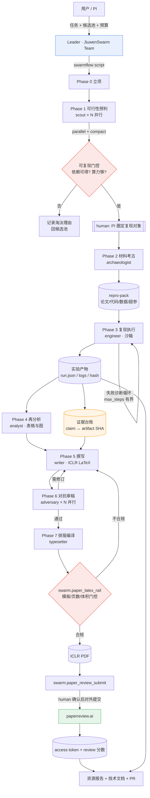

# PaperSwarm — 科研论文自动生成 Agent（基于 JiuwenSwarm）

**阶段**：Phase 0 需求锚定 + Phase 1 架构设计（待确认后进入 Phase 2）
**确认状态**：deliver_mode = 逐阶段确认
**日期**：2026-09-29

---

## 0. 已核实的技术底账

以下事实来自源码与官方文档的实读，不是记忆推断：

| 项 | 核实结果 | 来源 |
|---|---|---|
| 主体仓库 | `github.com/openJiuwen-ai/jiuwenswarm`（AtomGit 镜像 `atomgit.com/openJiuwen/jiuwenswarm`） | GitHub API |
| 发行包名 | `workswarm`，version `0.2.5.beta1`，PyPI 名 `jiuwenswarm` | `pyproject.toml` |
| 运行时要求 | Python `>=3.11,<3.14` | `pyproject.toml` |
| 底座框架 | `openjiuwen` ← `gitcode.com/openJiuwen/agent-core.git`，pin 在 commit `9e3390195a9ea15235b2b5f7412cb2aa440622cc` | `pyproject.toml` |
| License | Apache-2.0 | `pyproject.toml` |
| 运行配置 | `~/.jiuwenswarm/config/config.yaml`（由 `jiuwenswarm-init` 从 `jiuwenswarm/resources/config.yaml` 初始化） | 仓库模板 + 文档 |
| 扩展机制 | 纯声明式 harness 装配：`RailSpec` / `BuiltinToolSpec` / `SubAgentSpec` → provider 工厂 | `jiuwenswarm/agents/swarm/DESIGN.md` |
| 新增元素流程 | DESIGN.md §13 六步（NAMES 常量 → ConstructionInput → build 工厂 → @harness_element → config_specs 烘焙 → registry 注册） | 同上 |
| 确定性编排 | **SwarmFlow**：Python 脚本 + `META={...}` + `async def run(args)`；算子 `agent/parallel/pipeline/map_parallel/phase/human/human_session/budget` | `docs/zh/TUI使用SwarmFlow指南.md` |
| 团队技能 | **Swarm Skill** 5 文件规范：`SKILL.md` + `roles/*.md` + `workflow.md` + `bind.md` + `dependencies.yaml` | `docs/zh/SwarmSkills.md` |
| 技能库位置 | `~/.jiuwenswarm/agent/workspace/skills/`（全局唯一实体 + 可见性声明） | 同上 |
| 软上限 | `modes.team.jiuwen_team.swarmflow_budget`（team 级 token 上限，超限 run 直接 failed 且不可续跑） | 配置模板 |
| 轨迹落盘 | `team_observability.exporter: file` → `~/.jiuwenswarm/.trace`；另有 `trajectory_ui` SQLite 轨迹库 | 配置模板 |
| 评测入口 | `paperreview.ai`（Stanford Agentic Reviewer，Yixing Jiang & Andrew Ng；arXiv 检索锚定） | 官网 |
| 评测硬约束 | **PDF ≤10MB，仅分析前 15 页**；目标会议选 ICLR 时输出 1–10 综合分 | 官网 |

> 注：`openjiuwen`（agent-core）与本仓库是两个代码库。`openjiuwen/agent_teams/workflow/engine/facade.py` 等路径来自 agent-core，不在 jiuwenswarm 仓库内。

---

## 1. Phase 0 — 需求锚定

### 1.1 五要素

| 维度 | 内容 |
|---|---|
| **目标** | 交付一个跑在 JiuwenSwarm 上的多智能体系统，自主完成「选题 → 材料获取 → 复现实验 → 再分析 → 英文撰写 → 对抗审稿 → LaTeX 编译」全链路，产出一篇 ICLR 模板的英文 PDF 论文；并留下可追溯的资源台账与可合入上游的源码贡献 |
| **输入** | ① 候选复现对象池（公开论文 + 公开代码/数据集）；② 模型 API 凭证；③ ICLR LaTeX 模板；④ 算力/时间预算 |
| **输出** | ① 论文 PDF（英文，ICLR 模板，≤15 有效页、≤10MB）；② Agent 源码（改动的 jiuwenswarm 源码 + 新增 Swarm Skill 包 + Swarmflow 脚本）；③ 运行配置与环境依赖清单；④ 技术文档；⑤ 资源报告（token/时长，可追溯）；⑥ 框架贡献说明 + PR；⑦ paperreview.ai 评测结果 access token |
| **成功指标** | 见 §1.2（量化） |
| **约束** | 必须基于 openjiuWen 开源代码；必须真实修改 JiuwenSwarm 源码；论文实验必须来自**真实执行**而非模型编造；预算有硬上限 |
| **风险** | 见 §4.1 |

### 1.2 成功指标（可验证，不是许愿）

| 指标 | 目标值 | 验证方式 |
|---|---|---|
| 端到端完成率 | 从候选池任取一篇，全链路产出合规 PDF ≥ 1 篇 | Swarmflow run 终态 = `completed` |
| 数据可追溯率 | 论文中每一个数值型 claim 均绑定到 artifact 的 SHA-256 | 证据台账 `claims.jsonl` 与 PDF 交叉核对 |
| 编译合规 | ICLR 模板编译零错误；有效页 ≤15；PDF ≤10MB | `swarm.paper_latex_rail` 门控 + 本地 `pdfinfo` |
| 预算守约 | 单篇 ≤ 1,000 万 token 且 ≤ 100 美元（**比 FARS 的 1.14 亿 token / 1,040 美元低一个数量级；实测前为假设，非承诺**） | run 摘要 Team budget `spent/total` |
| 外部评测（**已锚定 FARS 基准**） | paperreview.ai 综合分（**venue 必须选 ICLR** 才出 1–10 分）：**及格 ≥4.21**（ICLR 2026 人类投稿均分）/ **良好 ≥5.05**（FARS 100 篇均分）/ **优秀 ≥5.39**（ICLR 2026 接收论文均分） | 回填 `review_result.json`；基准出处见 `fars-benchmark.md` §0.3 |
| 框架贡献 | ≥1 个 PR 提交上游，含测试通过证明 | PR 链接 + CI 状态 |

### 1.3 我做的假设（你不答我按此推进）

1. **论文主题 = 本系统自身**（自指打法）。理由：这是唯一能让"实验"和"资源报告"同源且真实的选择——论文的实验部分就是系统自己的复现运行，token/时长台账直接成为论文的数据，Stanford Reviewer 的分数成为客观外部信号。若你另有指定主题，Phase 1 的角色划分基本不变，只替换 `scout` 的候选池。
2. **复现对象来自公开池**。建议起点：Papers-with-Code 上带官方代码的论文 / ML Reproducibility Challenge 公开报告。具体 3–5 篇在 Phase 2 由 `scout` 产出候选并交你圈定。
   - 对齐 FARS 的 hypothesis 语义后，`scout` 产出的不是"一篇论文"，而是**一个可验证的复现假设**，例如「论文 X 报告的效应量在随机种子/硬件/数据切分变化下是否稳健」。复现型研究本身是合法的研究贡献形态（Reproducibility study），这样"复现与再分析"路线和 FARS 的"清晰的假设 + 可靠的验证结果"在结构上就是同一件事，不是降级替代方案。
3. **模型走 OpenAI 兼容 API**（可插拔 provider），默认建议 DeepSeek 系。**具体模型名/价格/上下文长度我未核实，标 `[待核实]`**，Phase 2 前以官方文档为准。
4. **不承诺"论文一定能被 ICLR 接收"**。只承诺：格式合规、数据真实、来源可追溯、外部评测分数可记录。
5. **凭证全部走环境变量**，不写入仓库、不写入日志、不出现在对话里。

### 1.4 C3 判定：这个需求真的需要 Agent 吗？

**必须先把话说清楚**：这条链路里，**大约 70% 是确定性工作流，30% 才真的需要自主决策**。

| 子任务 | 需要 Agent 吗 | 判定理由 |
|---|---|---|
| LaTeX 撰写、编译、格式核查 | ❌ 不需要 | 固定流程 + 门控即可，上 Agent 只是徒增不确定性 |
| 「选题 → 复现 → 撰写 → 审稿」的**阶段骨架** | ❌ 不需要 | 阶段固定、顺序固定、有质量门控 → 正是 SwarmFlow 的适用面 |
| 文献检索与候选筛选 | ✅ 需要 | 检索路径开放、结果非确定性，需迭代决策 |
| 复现实验的调试 | ✅ 需要 | 依赖冲突/报错/超参漂移是开放问题，需要「跑-看-修」循环 |
| 对抗审稿 → 修订 | ✅ 需要 | Evaluator-Optimizer 模式，停止条件必须显式定义 |

**结论**：采用**混合架构**——SwarmFlow 作为确定性主干（保证可复现、可审计、可设预算），在其内部节点上挂自主 worker（应对开放问题）。**不采用**「一个 Agent 自由发挥到底」的写法。这个判定本身会写进技术文档的"创新点/取舍"章节，因为它比方案本身更能说明工程成熟度。

---

## 2. Phase 1 — 架构设计

### 2.1 架构模式选型

| 层 | 模式 | 职责 | 失败处理 |
|---|---|---|---|
| 主干 | **Prompt Chaining + 专业化流水线**（SwarmFlow 脚本） | 阶段固定、串行、有质量门控；每阶段产出落盘为 artifact | 阶段失败 → 记录并进入 `bind.md` 定义的降级路径；不静默跳过 |
| 并行节点 | **Parallelization**（`parallel` / `pipeline` / `map_parallel`） | 多篇候选并行可行性预判、多维度再分析、多审稿人并行 | 失败项返回 `None`，由 `compact` 过滤并在报告中标注缺失 |
| 开放节点 | **Orchestrator-Workers** | Leader 分派给 scout / archaeologist / engineer | worker 超时 → 重试 1 次 → 降级为「标注缺失并继续」 |
| 质量闭环 | **Evaluator-Optimizer** | adversary 审稿 → writer 修订，至多 N 轮 | 分数停滞或轮次耗尽 → 停止并如实标注未解决项 |
| 人类介入 | **HITL**（`human` / `human_session`） | 候选圈定、超预算申请、最终放行 | 超时 → 取保守默认值并记录 |

**不采用** Autonomous Loop 作为主干：无边界自主循环在论文生成场景收益极低、失控成本极高。

### 2.2 架构图



### 2.3 组件（角色）表

| 角色 | 类型 | 职责 | 输入 | 输出 | 失败处理 |
|---|---|---|---|---|---|
| `leader` | JiuwenSwarm 内置 | 任务分解、成员分派、预算把控 | 用户任务 + 预算 | 任务看板 + swarmflow run | 成员失联 → 重新分派；预算 80% → 主动收束 |
| `scout` | ai_agent | **对齐 FARS-Ideation**：文献深度调研 + 从候选池筛出可复现对象 + 生成**可验证的复现假设**（含预期反向结果） | 候选池 + 研究方向文档 | `ideas/{id}/idea.md` + 可行性报告（依赖清单、算力估算） | 无法判定 → 标 `unknown` 并降优先级，不猜 |
| `planner` | ai_agent | **对齐 FARS-Planning**（原设计缺失，已补）：实验方案设计、基线/主实验规划、有效性评估方案、数据集/模型/算力配置 | `idea.md` | `plan/{id}/task_plan.json` + 算力估算 | 算力超预算 → 出降规模方案；仍超 → 交 PI 决策 |
| `archaeologist` | ai_agent | 拉取论文/代码/数据集/超参，固化环境快照 | 圈定的对象 | `repro-pack/`（含各文件 SHA + 环境锁） | 任一必需件缺失 → 标记 `blocked`，交 PI 决策 |
| `engineer` | ai_agent | 在沙箱内复现实验 | repro-pack | `artifacts/`（原始输出、日志、环境快照） | 报错循环：重试上限内自修；超限 → 如实上报失败，**禁止伪造成功** |
| `analyst` | ai_agent | 从产物出表与图 | artifacts | 表格/图 + 统计口径说明 | 样本不足 → 标注置信区间缺失，不做显著性声明 |
| `writer` | ai_agent | 撰写 ICLR 英文正文 | repro-pack + artifacts + 台账 | `.tex` 正文 | 缺证据的 claim → 直接不写，不降级为模糊表述 |
| `adversary` | ai_agent ×N | 对抗审稿：找无证据 claim、数字不一致、过度声明 | 正文 + 台账 | 结构化审稿意见 | 审稿意见无据 → 丢弃该条 |
| `typesetter` | ai_agent | LaTeX 编译与规范核查 | `.tex` | 合规 PDF | 编译失败 → 回 writer，带错误日志 |
| `PI` | **human_agent** | 圈定对象、超预算审批、最终放行 | 结构化问题 | 决策 | 超时 → 保守默认 + 记录 |

> 角色的 mermaid 流程与 persona 会写进 Swarm Skill 的 `roles/*.md`（含 `Inline Persona for Teammate`），按 SwarmSkills 规范每角色 5 章节齐全。

### 2.4 必须修改 JiuwenSwarm 源码的部分（PR 候选）

> ⚠️ **本节已被 `source-changeset-verified.md` 取代。** 实读源码后发现本节有三处判断错误：① 不能新增 `paper` 模式（模式矩阵是 8 模式 × 11 个耦合结构 + 测试守卫）；② 元素是**自门控**的，不需要按 mode 分档；③ 工厂 Rail 需要 Rail 基类契约，未核实前不臆造，门控改由 SwarmFlow 脚本步骤承担。以 `source-changeset-verified.md` 为准。


严格按 `jiuwenswarm/agents/swarm/DESIGN.md` §13 六步实现，不做"customizer 后处理挂载"这类违规写法。

**新增 Tool（4）**

| 元素名 | 职责 | params（属性） | context（环境） |
|---|---|---|---|
| `swarm.paper_artifact_fetch` | 拉 arXiv PDF / 代码仓库 / 数据集 | `cache_root`, `max_bytes` | `workspace_root`, `request_id` |
| `swarm.paper_experiment_runner` | 沙箱内执行复现实验 | `cpu_cap`, `mem_cap`, `wall_clock_cap`, `allow_network` | `project_dir`, `workspace_root`, `request_id` |
| `swarm.paper_claim_ledger` | 读写证据台账（claim ↔ artifact SHA） | `ledger_path` | `team_ws_root`, `request_id` |
| `swarm.paper_review_submit` | 提交 paperreview.ai 并回填 token（**危险操作，强制 HITL**） | `endpoint`, `venue`, `max_pdf_bytes` | `request_id`, `channel_id`, `session_id` |

**新增 Rail（4）**

| 元素名 | 职责 | 拦截点 |
|---|---|---|
| `swarm.paper_evidence_rail` | 写 LaTeX 前校验：正文中每个数值 claim 必须在台账中登记 | 结构性拦截，非 prompt 劝阻 |
| `swarm.paper_figure_rail` | 强制图表由 artifacts 程序化生成，禁止手写数字 | 产物层校验 |
| `swarm.paper_latex_rail` | 编译 + ICLR 模板/有效页 ≤15/PDF ≤10MB 门控 | 交付门控 |
| `swarm.paper_resource_rail` | 从 trajectory span 聚合 token/时长，产出可追溯资源报告 | 收尾 |

**配置层新增**

| 文件 | 改动 |
|---|---|
| `jiuwenswarm/agents/swarm/providers/*.py` | 新增上述 8 个元素的 `build_*` 工厂 + `@harness_element` 声明 |
| `jiuwenswarm/agents/swarm/registry.py` | re-export 新元素名常量 |
| `jiuwenswarm/agents/swarm/config_specs.py` | 新增 `_PAPER_RAIL_NAMES` / `_PAPER_TOOL_NAMES` 分档 + `_extract_*` 参数烘焙 |
| `jiuwenswarm/runtime/mode_catalog.py` | 新增 `paper` 模式（**待核实该文件的模式注册方式**） |
| `~/.jiuwenswarm/config/config.yaml` | 见 §2.6 |

**上游贡献策略**：8 个元素**按"通用性"拆成 2 个 PR**，不打包成 1 个巨型 PR。
- PR-1（易合入）：`paper_resource_rail` + `paper_latex_rail`——与具体论文场景解耦，任何长链路任务都能用。
- PR-2（场景性）：证据台账与实验执行相关元素——需先在上游 issue 讨论接口形态。

### 2.5 Swarm Skill 包（不侵入框架的复用层）

按 SwarmSkills 5 文件规范，落在 `~/.jiuwenswarm/agent/workspace/skills/paper-repro-swarm/`：

```
paper-repro-swarm/
├── SKILL.md               # name/kind: swarm-skill/roles（≥2 角色）
├── roles/                 # scout.md archaeologist.md engineer.md
│                          # analyst.md writer.md adversary.md typesetter.md
├── workflow.md            # mermaid 流程图 + Detailed Steps + Acceptance Criteria
├── bind.md                # max_parallel_teammates / wall_clock / token 预算 +
│                          # Behavioral Constraints + Failure Handling
├── dependencies.yaml      # skills: []  tools: [...]  （空段也必须显式写）
├── templates/             # ICLR LaTeX 模板与图表规范
└── scripts/workflow.py    # SwarmFlow 脚本（META + async def run(args)）
```

验证必须过 `swarmskill-creator` 的验证器（退出码 0），否则不算交付。

### 2.6 运行配置改造要点

```yaml
modes:
  team:
    jiuwen_team:
      enable_swarmflow: true
      swarmflow_budget: <正整数>        # 硬上限；超限 run 直接 failed 且不可续跑
      swarmflow_concurrency:
        max_workflows: 4
        max_agents_total: 24
team_observability:
  enabled: true
  exporter: file                       # 落 ~/.jiuwenswarm/.trace，资源报告的数据源
trajectory_ui:
  enabled: true                        # SQLite 轨迹库，逐节点可追溯
agents:
  agent_leader:                        # 强模型档：分解/仲裁
    max_iterations: 200
    completion_timeout: 6000.0
  agent_teammate:                      # 按角色再分档（抽取类用弱模型）
    max_iterations: 200
    completion_timeout: 6000.0
permissions:
  enabled: true
  permission_mode: strict              # 收紧：写盘/执行/外发均需明确策略
```

### 2.7 关键取舍

| 取舍 | 选了 | 放弃了 | 理由 |
|---|---|---|---|
| 主干形态 | SwarmFlow 确定性脚本 | 纯自主 Agent 长循环 | 可审计、可设预算、可复现；论文生产不需要开放式探索 |
| 防伪造 | **产物层结构性拦截**（台账 + rail 门控） | 只在 prompt 里写"不要编造" | "不要编造"是不可验证的约束，等价于没有约束 |
| 实验来源 | 公开代码/数据集的复现与再分析 | Agent 自造新实验 | 省算力、可对照公开结果验证真实性、审稿可辩护 |
| 修改范围 | jiuwenswarm 层（8 个 harness 元素） | 改 agent-core 内核 | 内核改动 PR 周期长、回归面大；harness 元素是官方指定扩展点 |
| PR 粒度 | 拆 2 个 PR | 打包 1 个 | 提高合入概率，符合上游 §13 新增元素规范 |

### 2.8 FARS 对标与它逼出来的 5 处修正

本次赛题的核心参考是 Analemma（日行迹）的 **FARS**。可核实事实已抽成事实卡：4 个 agent（Ideation / Planning / Experiment / Writing）、**共享文件系统兼作工作空间与持久记忆**、项目队列并行、160 GPU 集群、输出"短论文"且鼓励负结果；2026-02-13 至 02-23 的 **228.5 小时**里产出 100 篇，耗 **114 亿 token / 10.4 万美元**（**平均 1.14 亿 token、约 1,040 美元/篇**）；paperreview.ai 按 ICLR 标准评分 **均值 5.05**。详见 `fars-benchmark.md`。

**模块映射**：Ideation→`scout`｜Planning→`planner`｜Experiment→`engineer`+`analyst`｜Writing→`writer`+`typesetter`。`adversary` 对抗审稿与**证据台账**是本方案额外增加的。

**它逼出来的 5 处修正（已合入本文件）**：

| # | 修正 | 原设计的缺口 | 落地位置 |
|---|---|---|---|
| 1 | 补 `planner` 角色 | 只有筛论文 + 拉材料，**Planning 模块整体缺失** | §2.3 |
| 2 | 补项目队列 | 原为单篇串行；FARS 靠队列才有规模 | §2.6 `swarmflow_concurrency` |
| 3 | 成功指标改用外部基准 | 原来只有"产出合规 PDF"这类自证指标 | §1.2（4.21 / 5.05 / 5.39 三档） |
| 4 | 成本模型重建 | 原来只写"待实测" | §1.2、§4.1（目标 ≤100 美元/篇） |
| 5 | `scout` 升级为假设生成 | 原来只"筛出可复现论文"，对齐不上 hypothesis 语义 | §2.3 |

**一个天然对齐点**：FARS 的"共享文件系统兼作记忆"在 JiuwenSwarm 里本来就存在——team workspace 承载 `repro-pack/` 与证据台账，`team_observability` 的 file exporter 承载轨迹。这一点不需要我们改造，直接用。

**明确不追的部分**：FARS 用 100 篇建立统计效力，我们跑不了。我们只跑 1 篇完整链路 + 3–5 篇前段（仅统计可行性预判准确率与单位成本），并在技术文档中**明确声明论文质量分布无统计效力**——不假装。

---

## 3. 验证方式（Phase 2 起逐条执行）

| 编号 | 验证项 | 命令/方式 | 期望 |
|---|---|---|---|
| V1 | 环境可跑通 | `uv venv && uv pip install -e . && jiuwenswarm-init && jiuwenswarm-start` | 服务起在 `http://localhost:5173` |
| V2 | 新增元素注册成功 | `pytest tests/agents/swarm/test_manifest_catalog.py` | catalog ↔ 注册表 parity 通过 |
| V3 | 装配回归 | `pytest tests/agents/swarm/test_swarm_assembly.py` | 构造回归全绿 |
| V4 | Swarm Skill 合规 | `python3 .../swarmskill-creator/scripts/validate_swarmskill.py <path>` | 退出码 0 |
| V5 | 端到端产出 | SwarmFlow run | 终态 `completed`，产出 PDF |
| V6 | 合规门控 | `pdfinfo paper.pdf` | 页数 ≤15，体积 ≤10MB |
| V7 | 数据可追溯 | 台账 ↔ PDF 逐条核对 | 数值 claim 100% 有来源 |
| V8 | 外部评测 | paperreview.ai（ICLR） | 返回 review + access token |

量化指标：成功率、P95 单篇墙钟时长、单篇 token 成本、工具调用失败率——四项全部从 `team_observability` 的 file exporter 落盘数据计算，可追溯。

---

## 4. 风险与下一步

### 4.1 风险清单

| 风险 | 概率 | 影响 | 对策 |
|---|---|---|---|
| 复现失败（依赖老化/数据下架/算力不足） | **高** | 高 | 可行性预判门控前置；候选池备 ≥3 篇；失败如实上报而非伪造 |
| 论文被 reviewer 判为无新意 | 中 | 中 | 把"协调工程 + 证据台账"作为核心贡献；用 Reviewer 分数驱动修订 |
| Token 成本失控 | 中 | 高 | `swarmflow_budget` 硬顶 + `budget.remaining()` 动态收束 + 角色分档路由 |
| **触发 `swarmflow_budget` 硬顶 → run 直接 failed 且不可续跑**（JiuwenSwarm 既有行为） | 中 | 高 | 预算留 20% 余量；各阶段产物逐段落盘，重跑可复用已完成部分 |
| **与 FARS 的差距被直接横向对比**（1,040 美元/篇 vs 我们 ≤100 美元/篇） | **高** | 中 | 不回避：技术文档正面论证「1/10 成本下的可信度权衡」，把成本差距转化为贡献点，并用实测单位成本数据支撑 |
| 复现对象选到需大算力的论文（FARS 自承的局限正好落在这里） | 中 | 高 | `scout` 硬性筛除：参数量小、单卡可跑、数据公开、训练以分钟计 |
| PR 被上游拒收 | 中 | 中 | 拆小 PR、先开 issue 对齐接口、附完整测试 |
| 无 API key，Phase 2 无法真跑 | **确定** | 高 | Phase 2 前必须拿到凭证；否则只能交付代码 + 复现指南，无法产出论文与资源报告 |
| paperreview.ai 无公开 API | 中 | 中 | **未核实到官方 API 文档**，可能只能人工网页提交；`swarm.paper_review_submit` 需按实际接口调整 |
| 修改源码后与上游演进冲突 | 中 | 中 | 8 个元素全部走官方扩展点，不 patch 私有函数 |

### 4.2 下一步（按优先级）

1. **你确认 Phase 1 架构与 §1.3 的 5 条假设**（尤其"论文主题=本系统自身"）。
2. 你提供模型 API 凭证（走环境变量，不要贴在对话里）。
3. 我执行 Phase 2：搭环境跑 V1 + V2 + V3 竖切片，证明扩展点真的能用。
4. 落 Swarm Skill 5 文件 + Swarmflow 脚本，跑 V4。
5. 端到端跑 1 篇，收 V5–V8 数据。

---

## 5. 待确认清单

| 编号 | 待核实项 | 核实方式 |
|---|---|---|
| Q1 | `jiuwenswarm/runtime/mode_catalog.py` 新增模式的注册方式与约束 | 读该文件源码（Phase 2 第一步） |
| Q2 | paperreview.ai 是否存在官方 REST API / 自动提交能力 | 官网 + 邮件 `aireviewer@cs.stanford.edu` 确认；无则改人工提交 |
| Q3 | 拟用模型的型号/价格/上下文长度 | 官方文档，**禁止凭记忆填写** |
| Q4 | `jiuwenbox` 是否可作为复现实验的沙箱，及其资源隔离能力 | 读 `jiuwenbox/src` 源码 |
| Q5 | ICLR 模板的官方来源与页码规范 | ICLR 官方作者指南 |
| Q6 | `swarmflow_budget` 的合理取值 | 需先做单篇成本实测，再定预算 |
| Q7 | FARS 的门控只在 Ideation 出口，还是 Planning 也有自动审查 | 官方博客原文 + GitLab `gitlab.com/fars-a` 公开提交记录 |
| Q8 | FARS 的 RLVR 具体作用在哪个环节（假设筛选 / 实验 / 写作） | 同上 |
| Q9 | FARS 公布的 5.05 均分是首轮稿还是修订后稿的分 | FARS 官网项目列表逐篇查看 |
| Q10 | 我们 ≤100 美元/篇的目标成本是否可达 | Phase 2 单次真实运行实测单位成本 |

---

## 6. 交付物清单（对照你的要求逐条映射）

| 你要的成果 | 本方案对应产出 | 状态 |
|---|---|---|
| 科研论文 PDF（英文，ICLR 模板） | Phase 7 产物 + §3 V5/V6 门控 | 待实现 |
| openJiuwen Agent 源码（含注释、工程说明） | 8 个 harness 元素 + Swarm Skill 包 + Swarmflow 脚本 | 待实现 |
| 运行配置、环境依赖、复现指南 | §2.6 配置 + `README` + `requirements` 锁版本 | 待实现 |
| 技术文档（架构/模块调用/创新点） | Phase 1/2/3 设计 + 模块调用链 + 4 条创新点 | **本文件即初稿** |
| 资源报告（token/时长，可追溯） | `swarm.paper_resource_rail` 从轨迹聚合 | 待实现 |
| 框架贡献说明 + PR 链接 | §2.4 双 PR 策略 + 贡献文档 | 待实现 |
| Stanford Reviewer access token | Phase 8 提交并回填 | 待实现（依赖 Q2） |
